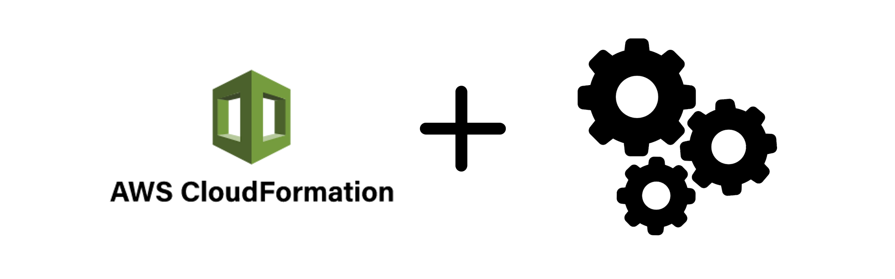

 # Basic Setup: VPC, Subnets + RouteTables, Internet + NAT Gateways, Security Group, Bastion Server, Application Load Balancer, ECR!
 

 **`cloud-formation-aws.yaml`** - cloudformation file for AWS.

 **What's customizable:**
1. VPC.
2. 4 Subnet (2 Public and 2 Private).
3. Configure RouteTable.
4. NAT
5. Security Group
6. Bastion Server
7. Application Load Balancer
8. Elastic Container Registry

**You need to create a PEM key yourself. `Example: StackName-aws-key`, StackName - must match the name of the CloudFormation task.**

## License
Cleaning file is Copyright © 2015-2021 Codica. It is released under the [MIT License](https://opensource.org/licenses/MIT).

## About Codica

We love open source software! See [our other projects](https://github.com/codica2) or [hire us](https://www.codica.com/) to design, develop, and grow your product.
